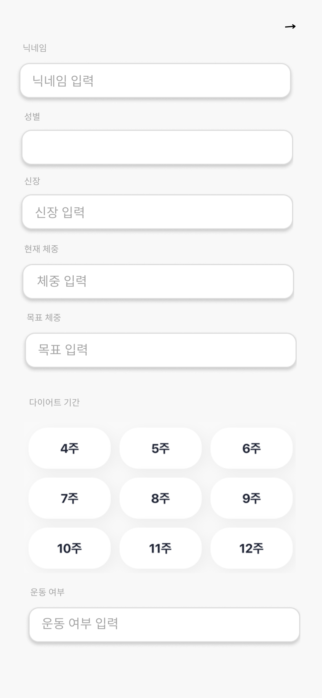

# UX

## 1. UX 란?
UX(사용자 경험)는 사용자가 제품이나 서비스를 사용할 때 느끼는 모든 경험을 의미한다.

Flow 와는 조금 다른데, 우리 어플의 강점이나 정체성 등이 드러나는 포인트 등에 대해 정의하고

그에 맞추어서 사용자가 우리 어플에서 경험할 수 있는 요소를 정의하면 되겠다.

그러면, 화면을 정의하기가 더 쉬워진다.

## 2. 우리 어플의 강점과 정체성
- 사용자가 원하는 것에 따라서 커스터마이징하여 식단을 추천할 수 있다.
- 챗봇이 먼저 사용자에게 질문할 수 있다.
- 동적으로 계획하기 때문에, 유연하게 대처할 수 있다.
- 사람에게 말하지 않아도 된다. (부끄럽게 어제 뭐 먹었는지도 보고해야 하는 경우...ㅠ)
- 음성 인식 + AI 응답이 가능하다
- AI 와 소통하다 보면, 캘린더에 자동으로 등록될 수 있다.

## 3. 우리 어플에서 사용자가 경험할 수 있는 기능  (상황에 따라 정리)

### 3-1. 방금 어플에 막 들어온 경우
성별, 나이, 현재 체중, 목표 체중, 목표 기간, 신장, 활동 수준 (운동 여부 및 빈도)를 사용자에게 받아내기만 하면 됨.

[Form 데이터로 받을 수도 있고, 챗봇 형식으로 받을 수도 있음]
- Form 형식을 받아 오면 : 효율적이고 빠르게 받아 올 수 있음
- 챗봇 형식을 받아 오면 : 인상적인 사용자 경험을 제공할 수 있음

초기 정보는 Form 데이터로 받기로 함. 받아야 하는 정보가 매우 단순하고, 많고, 정확해야 하기 때문에 초기 정보를 받음에 있어서 STT 를 사용하는 것은 지양하는 방향으로.

### 3-2. 지난 식단을 토대로 앞으로의 식단을 조절하고 싶은 경우
- ex_ "오늘 저녁에 회식이 있어서 삼겹살 200g 과 소주 한 병을 먹었는데, 오늘 조금 덜 먹어야 할 것 같아. 오늘의 식단을 수정해 주겠어?"
- ex_ "오늘 아침을 안 먹었는데, 점심과 저녁에 얼마나 더 먹어도 될까?"
- 사용자의 의견을 음성으로 받을 수도 있고, 텍스트로도 받을 수 있게.

### 3-3. 재료에 따라 식단을 바꾸고 싶은 경우
- ex_ "집에 고등어와 삼겹살이 있는데, 오늘 하루 2000kcal를 먹으려 해. 아침부터 저녁까지 식단을 짜 줘."

### 3-4. 원푸드 다이어트
- ex_ "나는 키토 다이어트를 할 건데, 그에 맞는 음식을 추천해 줘."
- ex_ "나는 원푸드 다이어트를 할 건데, 얼마나 먹어야 해?"

### 3-5. 먹고 싶은 음식을 바꾸고 싶은 경우
- ex_ "닭가슴살을 먹기 싫은데, 대체할 수 있는 음식을 추천해줘."

### 3-6. 평소 식사하는 시간인데, 아직 정보가 올라오지 않은 경우
- ex_ "이 정도 시간이면 항상 밥을 먹던데, 나한테 안 알려 줄 거야?" 라고 먼저 메시지를 보내는 형태
- ex_ "지금 점심인데 아직 아침 얘기를 못 들었네..ㅠ 아침 건너 뛴 거야?" 라고 먼저 메시지를 보내는 형태

### 3-7. 알레르기가 있는 경우
- AI 가 개인의 DB 를 가져와서 피해야 할 음식을 알려줄 수 있음 (알레르기 RAG)

### 3-8. 탄 / 단 / 지 / 칼로리 뿐만 아니라, 다른 영양소에 대해서도 잘 알려줄 수 있는 AI
- 트레이너라고 하더라도, 영양학에 대해서 깊이 있게 공부한 게 아니라 -> 디테일한 조언 불가
- 하지만, 영양학 DB 를 RAG 로 참고하여 일반적인 트레이너보다 훨씬 더 디테일하게 조언 가능

### 3-9. 캘린더
- 캘린더는 DB 에서 식단 정보를 가져 옴.
- 내일 메뉴를 바꿔 달라고 하는 등의 식단 변경 요청이 들어오면 -> 캘린더의 식단이 바뀜

## 4. 화면 정의서 링크
[Canva 링크](https://www.canva.com/design/DAGTtUIA7ZM/M7e-qtllK0bfV4UaN-i51g/edit)